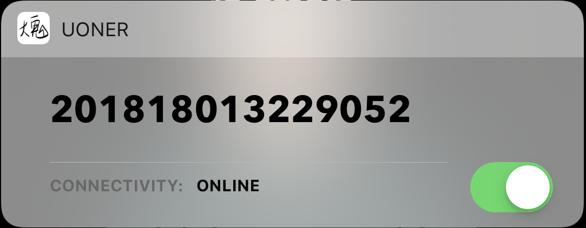

# Uoner:

> Elegant network client for [UCAS](http://www.ucas.edu.cn)

## Screenshots

## Features

- [x] Login & Logout
- [x] Today Extension

## Requirements

- Swift 5+
- Xcode 10.2.1+
- macOS 10.14+

## FAQ

### What's the origin of the name Uoner?

The project is derived from [Boner](https://github.com/Chriskuei/Boner). Uoner stands for UCAS Online, an elegant network client for UCAS.

---

## Acknowledgements

- [Alamofire](https://github.com/Alamofire/Alamofire)

## Contribution

- If you need help or you'd like to ask a general question, open an issue.
- If you found a bug, open an issue.
- If you have a feature request, open an issue.
- If you want to contribute, submit a pull request.

## Credits

Uoner is owned and maintained by [Chriskuei](http://github.com/chriskuei).

## License

Uoner is released under the MIT license. See [LICENSE](LICENSE) for details.
